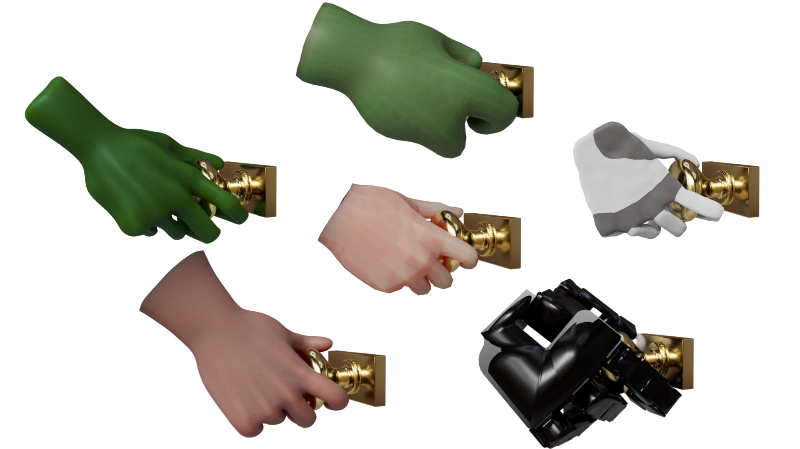
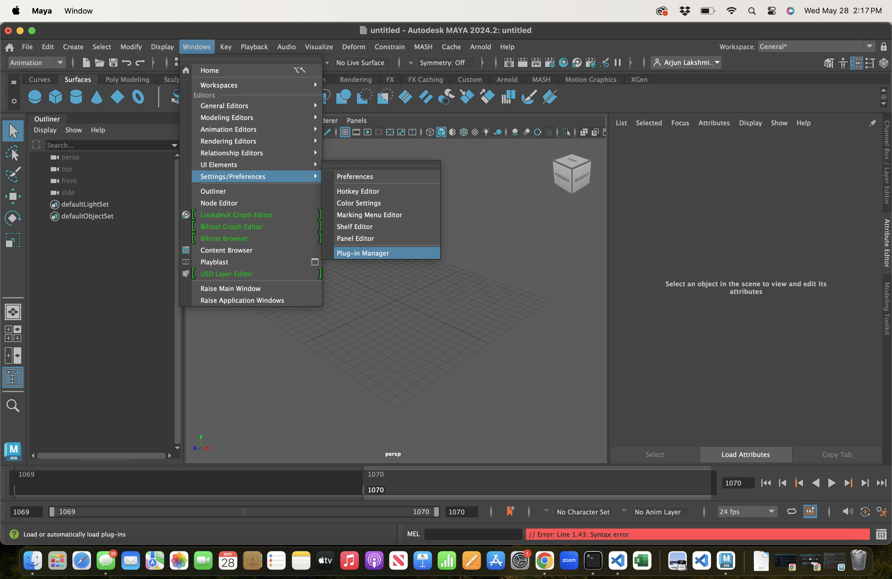

<p align="center">

</p>
<h1 align="center"><em>Kinematic Motion Retargeting for Contact-Rich Anthropomorphic Manipulations </em></h1>

Code for <a href="https://dl.acm.org/doi/10.1145/3723872">paper</a>

## Introduction

This code is intended to be executed as a collection of plugins for Autodesk Maya. If you are unfamiliar Maya, there are a number of YouTube tutorials on getting started. It does not assume any prior knowledge beyond knowing how to navigate the viewport and a basic understanding of the default toolset. The code itself is primarily written in C++, is built with CMake, and requires the C++ 20 standard or higher. There are also some additional Python and MEL (Maya scripting language) scripts that are used for utility purposes. This codebase is intended to walk users through the process of creating results for *new hands* from scratch or, alternatively, creating retargeted motions for *new motions* for one of our existing hands.

For those who are only looking to download complete results for baseline comparisons or downstream applications, I strongly suggest just downloading the Maya files directly from <a href="https://drive.google.com/drive/folders/1O33tOWO4Vpb1knBHtDXSwhtUHMGdyZfS">here</a>.

You can also download our hands and other assets from <a href="https://drive.google.com/drive/folders/1yZNd8S02GbZjkFYTiGYOYGZ3CKxrzuxU">here</a>. Please see the README file in the drive folder for an overview of contents.

## Why on earth are you using Maya instead of literally anything else (e.g. Blender, Open3d, \<insert favorite Python visualizer\>)?

Because I had to familiarize myself with it during the development of <a href="https://dl.acm.org/doi/10.1145/3592117">this paper</a>. Yes, I realize Maya is closed source. Yes, I realize Maya is cumbersome to build on Linux distributions and has some problems. But it does have a rather nice UI and, more importantly, a well documented <a href="https://help.autodesk.com/view/MAYAUL/2024/ENU/?guid=MAYA_API_REF_cpp_ref_group_open_maya_html">C++ developer API</a>. As the sole developer of this work, I opted to use what was most useful and convenient for my research needs. However, I am more than happy to provide guidance if someone is interested in porting this code to Blender or a Python package. But I personally do not have the bandwidth to do so.

## Installation

You will first need to download and install Autodesk Maya, as well as obtain a valid license key.

If you do not already have CMake installed, please do so as well. You will also need OpenGL, but this should typically come installed on most systems.

Next, install <a href="https://eigen.tuxfamily.org/dox/">Eigen</a> and <a href="https://github.com/madler/zlib">Zlib</a>. The easiest way to do so is via a package manager (Hombrew on Mac, apt on Linux). On Windows, I recommend Eigen via Chocolatey. For ZLib (not available via Chocolatey), your best option is to download to pre-build binary <a href="https://github.com/CristiFati/Prebuilt-Binaries/tree/master/ZLib/v1">here</a> and then run CMake with <a href="https://stackoverflow.com/questions/79381766/install-zlib-library-on-windows-for-msvc">this flag</a>.

Next, clone this repository *recursively* to make sure all dependency submodules are fetched:

```
git clone --recursive https://github.com/lakshmipathyarjun6/kinematic_motion_retargeting.git
cd kinematic_motion_retargeting/
```

Before building, change the Maya version in the CMake file <a href="https://github.com/lakshmipathyarjun6/kinematic-motion-retargeting/blob/main/CMakeLists.txt#L6">here</a> to whatever year / version of Maya you installed on your machine. The default CMake file assumes 2024. This code should be foward and backwards compatible by at least a few years, but please let me know if you encounter problems with your version so I can flag the earliest / latest compatible versions.

You can now generate the CMake project:

```
mkdir build
cd build/
cmake ..
make -j5
```

And build:

Mac and Linux:
```
make -j5
```

Windows: Assuming you are using Visual Studio (strongly recommended), open the .sln file that was created in the build fuilder. Set the build configuration to Release mode, then run ALL_BUILD on the right panel.

If successfull, you should see a number of dynamic libraries (.bundle on Mac, .mll on Windows, .so on Linux) generated in the build (or on Windows, build/Release) folder.

The final step is to make the plugins visible to Maya. While you can load them individually on Maya startup, this is cumbersome. Instead, I suggest pointing your Maya environment path to the build folder location. To do so, navigate to the following location:

Mac:
```
cd ~/Library/Preferences/Autodesk/maya/<year>/
```

Linux:
```
cd ~/maya/<year>/
```

Windows:
```
TODO
```

And add the following line to the Maya.env file in that location:

```
MAYA_PLUG_IN_PATH=/path/to/project/kinematic_motion_retargeting/build
```

This line will instruct Maya to automatically make all plugins in the build folder visible on startup.

## Maya Setup

I strongly recommend starting Maya via command line instead of the Desktop shortuct. This will make debugging / print statements visible in the console.

Once Maya starts up, either in a new or existing scene, navigate to Windows >> Settings/Preferences >> Plug-In Manager in the main navigation bar:

<p align="center">

</p>

If you set your Maya.env file to point to your build folder, all the plugins should be visible:

<TODO: Plugin visibility>

Select "Auto load" as well as "Loaded" on all the plugins. Make sure there are no errors, then save the current scene (you can delete it afterward) and restart Maya. The plugins should now automatically be loaded whenever Maya is started.

If you wish to edit the code of any existing plugin, please note that Maya (to the best of my knowledge) does *not* support hot-reloading. In other words, to test new code / edits, the process is save edits -> re-compile the CMake project (make -j5 in the build folder) -> restart Maya.

The plugins for this project are all built as IO plugins or Edit Context plugins. If you are generally interested in building new plugins, either in conjunction with this repository or in a separate project, I would highly recommend <a href="https://www.cgcircuit.com/course/introduction-to-the-maya-api">this video series</a>. I consistently referred to it when building Maya projects - please consider supporting this creator :smile:.

By default, Maya's world space is configured to use *centimeters* for distances, degrees for angles, and a Z-Up ground plane configuration. You can modify any of these via Windows >> Settings/Preferences >> Preferences >> Settings. These settings will be saved between restarts and only adjust the settings of the active UI. You may access information in any convention via the API.

## Maya Plugin Activation

Many of the plugins in this repository are custom "Edit Context" plugins, which are essentially tool plugins that hook into the primary scene graph with read and write privileges. The paintbrush, cursor, and other default Maya tools on the left panel can all be thought of as Edit Context plugins. All loaded edit context plugins are available in the Maya editor, but must be activated and de-activated. Only one edit context can be active at a given time. Importantly, while all plugins inherit some default behaviors (e.g. camera navigation), they are responsible for defining their own behaviors for others (e.g. left-mouse click, drags, etc.). As such, you should generally NOT expect default behaviors (e.g. clicking outside the object to de-select it) to be retained when plugins are active.

The plugins in this repository need to be activated directly via MEL commands entered in the Maya command window. Each plugin README will provide the MEL command to run.

Edit context plugins can also (optionally) be given a customized toolkit that will be setup and torn down when the plugin is activated and de-activatd. This toolkit will replace the data in the Tool Editor window. Each plugin README will explain how to use its toolkit. The locations of both these windows are shown below:

<TODO: Tool windows>

## Processing New Hands and Motion Data

The general "flow of primary plugins" to use when preparing a new hand for retargeting is:

<a href="https://github.com/lakshmipathyarjun6/kinematic-motion-retargeting/tree/main/src/markerCalibrationContext">markerCalibrationContext</a> -> <a href="https://github.com/lakshmipathyarjun6/kinematic-motion-retargeting/tree/main/src/contactAxisCalibrationContext">contactAxisCalibrationContext</a>

And for importing a new motion and generating a retargeted sequence:

<a href="https://github.com/lakshmipathyarjun6/kinematic-motion-retargeting/tree/main/src/GRABMotionSequenceIO">GRABMotionSequenceIO</a> -> <a href="https://github.com/lakshmipathyarjun6/kinematic-motion-retargeting/tree/main/src/contactRaytraceContext">contactRaytraceContext</a> -> <a href="https://github.com/lakshmipathyarjun6/kinematic-motion-retargeting/tree/main/src/contactTransferEditContext">contactTransferEditContext</a> -> <a href="https://github.com/lakshmipathyarjun6/kinematic-motion-retargeting/tree/main/src/fusedMotionEditContext">fusedMotionEditContext</a> -> <a href="https://github.com/lakshmipathyarjun6/kinematic-motion-retargeting/tree/main/src/smoothMotionEditContext">smoothMotionEditContext</a>

Please see the README in each sub-folder for an overview of how to use each plugin. There are also a number of auxiliary plugins included to help with importing / exporting data.

## Creating Manifold Wrappers for Articulated Hands

While there are plenty of great tutorials online for creating skinned character rigs (e.g. <a href="https://www.youtube.com/watch?v=c538zkwxgTQ">this</a> or <a href="https://www.youtube.com/watch?v=rAZpH3m7K5U&list=PLbvsJz5ZcmxHEPiw_kF3vHjR023rIjR05">this</a>), I've generally found there to be little guidance online for dealing with articulated hands. Articulated hands stored as URDFs, for example, are commonly used in robotics; however, approximating such hands with smooth, continuous, manifold wrappers is often desirable to abstract away high-resolution geometric details and make the model "play nicely" with many algorithms in geometry processing and character animation, including the methods in this paper.

I have therefore created this companion video [TODO: create video] to show one way to do this. Please watch it if you are trying to use this codebase with a new articulated robot hand. The remainder of the codebase will assume that your hand is manifold and has already been rigged and skinned. 
