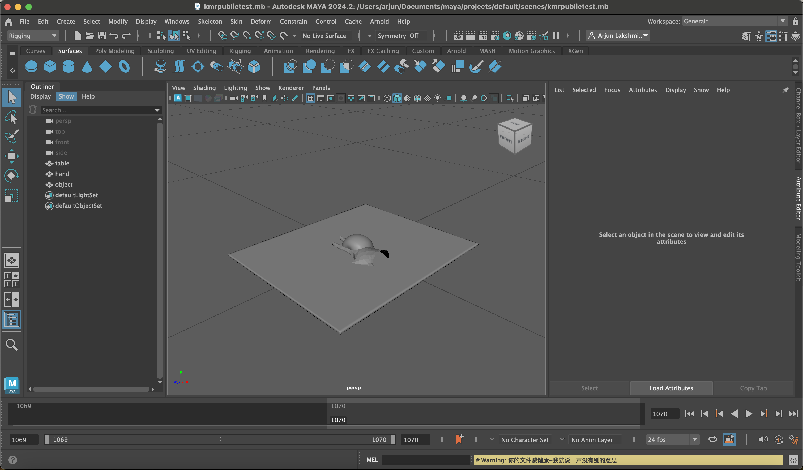
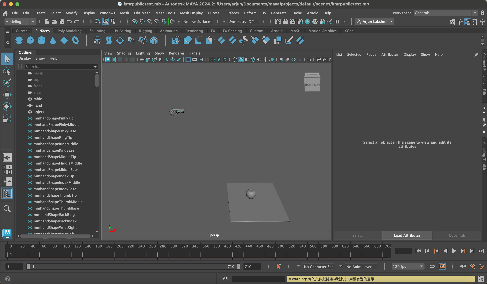

# Exporting and Importing Data from the GRAB Dataset

This plugin imports data from the <a href="https://grab.is.tue.mpg.de/">GRAB dataset</a>, which serves as the source for all our original motions, into Maya.

## Getting started

Download and unpack the dataset to get started. Please note that we do not own the rights to this dataset and are unable to host any original content. By downloading this dataset, you agree to all the terms and conditions set forth by GRAB's license.

You will also need to download (and agree to the terms and conditions of) the MANO hand model, which is available <a href="https://mano.is.tue.mpg.de/">here</a>. Unzip and rename the downloaded folder to just 'mano', then move the MANO_LEFT and MANO_RIGHT pkl files under the 'models' subfolder to the top-level folder (e.g. your path should be mano/MANO_RIGHT.pkl). 

Finally, please clone <a href="https://github.com/lakshmipathyarjun6/GRAB">my fork of the GRAB processing repository</a>.

## Exporting original GRAB data

Because processing raw GRAB npz files requires the use of custom Python libraries, we need to convert the raw data into a format which is entirely self-contained and can be loaded into a third-party viewer (e.g. Maya). Create a conda or other virtual environment and install any packages required by the GRAB code repository.

Next, create a destination folder for any data exports.

If all is set up correctly, you should be able to run the following:

```
cd GRAB/grab
python exportRhandFullSequence.py --grab-path <PATH_TO_GRAB_DATASET_FOLDER> --out-path <PATH_TO_YOUR_EXPORT_FOLDER> --model-path <PATH_TO_YOUR_MANO_FOLDER> --motion-path <PATH_TO_GRAB_MOTION_YOU_WANT_TO_EXPORT>
```

So, for example, if the GRAB data, export, and mano folders are all under Downloads, you can export the apple pass task motion for subject 5 via:

```
python exportRhandFullSequence.py --grab-path ~/Downloads/GRAB --out-path ~/Downloads/exports --model-path ~/Downloads --motion-path ~/Downloads/GRAB/grab/s5/apple_pass_1.npz
```

This should create three files in your export folder under the subdirectory s5:

1. The fitted MANO hand mesh for the subject (.obj)
2. The object mesh (.obj)
3. The motion and contact sequence export (.npz)

In addition to the object mesh, there is also a dedicated mesh for the table under the object_meshes subfolder of the GRAB data. Go ahead and convert this to an OBJ, and rename it to something other than table.obj (otherwise Maya will not allow you to rename it to 'table' in the scene later).

This gives us all the data we need to reconstruct the scene in Maya.

## Importing GRAB scenes into Maya

Create a new Maya scene, then import the MANO, object, and table OBJ meshes. Rename each in the scene editor to "hand", "object", and "table" respectively (very important). Your scene should look something like this:

<p align="center">

</p>

Change the framerate to 120 fps, and set the timeline to the frame range of the motion.

If the plugin is already loaded, you are ready to import the motion. Open the import menu and change the filetype to npz. After completion, re-center the camera to the scene (hotkey: f). The scene should look like the following:

<p align="center">

</p>

You can now play and scrub through the animation using timeline. This completes the import.

Finally, because I intended to eventually export these motions into Mujoco / physics simulation for <a href="https://www.andrew.cmu.edu/user/aslakshm/pdfs/RSS2024WorkshopContactMPC.pdf">this</a> downstream paper, and because the table was thin and not a perfect box, I did not use the table imported by the data. Instead, I fitted my own table to the scene and left a lot of free-space clearance before the object to accommodate long-fingered hands. You thus need to replace the dataset table with an actual box geometry (cube polygon primitive). The scale dimensions of the cube will be extracted by the solver to compute the SDF.
