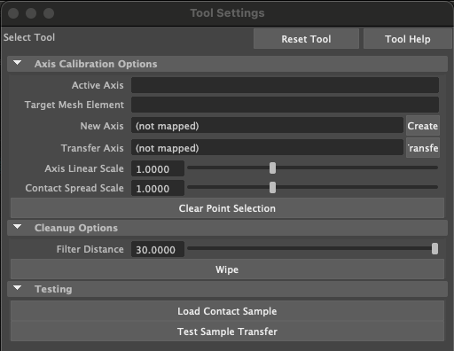

# Retargeting Contacts to Different Hands

This Edit Context plugin enables creating and editing landmark placements on both hands in order to tweak the corresponding atlases. For convenience, it uses axial curves to treat each group of landmarks as a single entity using techniques in <a href="https://dl.acm.org/doi/10.1145/3592117">this paper</a>.

## Setup

If you only intend to use our target hands, you can skip this plugin altogether and instead just download one of our <a href="https://drive.google.com/drive/folders/1d9EjWqPb09t-DLPoEz1aoiV9DDeMPyME">existing annotated files</a>. 

NOTE: At this time, source code is not available for this plugin. Because it uses many techniques from the cited paper, it was easier to just use a pre-built plugin from source code built for that repository rather than making one from scratch. But we have not yet figured out licensing for that code, and we cannot distribute it without one. Instead, we have created pre-compiled binaries of this plugin for all major operating systems that can be downloaded <a href="https://drive.google.com/drive/folders/1CJtLK6fQnnb_Y75wDhZSsT6FsGoL5nvr">here</a>. Your operating system (e.g. Mac) may complain about this and refuse to load it because it is coming from an unidentified developer. If this happens, please go to your security settings (e.g. System Settings -> Security & Privacy on Mac) and allow the plugin to load anyway. I promise that it will not install malware on your system :smile:.

To get started, download the binary for your operating system and install it in the same build folder as the others. Then open Maya and set this plugin to auto-load on startup. The plugin assumes that the source hand is labeled as "hand" in the scene outline - the target hand can have any name. 

Next, copy the MEL files under the /scripts subdirectory to the following location:

Mac:
```
cp path/to/project/kinematic-motion-retargeting/src/contactAxisCalibrationContext/scripts/* ~/Library/Preferences/Autodesk/maya/<year>/scripts
```

Linux:
```
cp path/to/project/kinematic-motion-retargeting/src/contactAxisCalibrationContext/scripts/* ~/maya/<year>/scripts
```

Windows:
```
TODO
```

## Plugin activation

Run the following MEL command to activate the plugin:
```
setToolTo acc
```

If successfull, you should see the following Tool Editor menu:

<p align="center">

</p>

## Plugin tools

"Active Axis": Sets the active axis to axis specified by name. I do NOT recommend typing this out by hand - instead, copy past the name of the desired axis from the scene outliner. All axes are prefixed by "axis_".

"Target Mesh Element": Selects a specific mesh element on the target hand in general coordinates (face-indexed "f <face_index> <barycentric_coord_1> <barycentric_coord_2> <barycentric_coord_3>", edge-indexed "e <edge_index> <linear_interp_time_between_vertices>", or vertex-indexed "v <vertex_index>"). Please take a look at some of our <a href="https://drive.google.com/drive/folders/1GpgiqBR3Rk-KwXp7TyCOAiYtSm13JGLJ">axis landmark exports</a> or <a href="https://drive.google.com/drive/folders/1cm4nhnLJvYs1p_sssrYCZD2yINgBIE_b">contact exports</a> for examples if you are not sure how this type of indexing works. This is a utilty tool to be used in conjunction with transfering an axis. For example, if you want an axis to be formed between two very specific endpoints, then it is easier to provide an exact element rather than whatever is selected by clicking. However, I would generally NOT recommend doing this and instead just selecting elements via the click interface.

"New Axis": Creates a new axis with the given name. You MUST follow a specific naming convention because this tool does NOT auto-convert your name to a valid one. The convention is "axis_<name_of_hand_in_scene_outliner>Shape_<Common_Name>". So for example, to create a "Palm" landmark axis on a hand titled "hand" in the outliner, you would need to name is "axis_handShape_Palm". After the name has been provided, hit Enter (NOT the "Create" Button). You can now select the start point and end point of the axis on the mesh, which will be rendered as yellow dots. After two points have been selected, click the "Create" button on the right hand side of this line. This will complete the creation process, and you should be able to see the new axis rendered on the viewport and added to the scene outliner. For further details, please see the <a href="https://youtu.be/9q-ZZtBrBwc">usage video</a>.

"Transfer Axis": Sets the name of the axis on the SOURCE hand to transfer. I do NOT recommend typing this out by hand - instead, copy past the name of the desired axis from the scene outliner. After the name has been provided, hit "Enter". You can now select a start point and end point on TARGET hand from which the axis will be reconstructed. After two points have been selected, click the "Transfer" button on the right hand side of this line. This will complete the transfer process, and you should be able to see the new axis rendered on the viewport and added to the scene outliner. Corresponding transferred axes on the source and target hand will have the same color scheme.

"Axis Linear Scale": Adjusts the value of $\lambda$<sub>A</sub> for the active axis.

"Contact Spread Scale": Adjusts the value of $\lambda$<sub>S</sub> for the active axis. This value is stored in the scene outliner and is queried by the <a href="https://github.com/lakshmipathyarjun6/kinematic-motion-retargeting/tree/main/src/contactTransferEditContext">contactTransferEditContext</a> plugin.

"Clear Point Selection" Button: Clears the current point selections (e.g. yellow dots) during the axis creation or transfer process.

"Filter Distance": Sets the geodesic distance threshold from each contact point's affiliate landmark. Any contact points further away than this threshold will not be rendered. Note that this tool is only for prototyping / testing thresholds within the context of this plugin.

"Wipe" Button: Wipes the axis currently selected in the scene outliner (NOT the active axis name in the tool window).

"Load Contact Sample" Button: Renders the currently selected contact in the scene outliner.

"Test Sample Transfer" Button: Performs a transfer of the currently loaded contact sample according to the parameters set above and renders the result.

Blue rings around landmarks in the main viewport: Adjusts the intermeidate turning angles between landmarks following the method in <a href="https://dl.acm.org/doi/10.1145/3592117">this paper</a>. See <a href="https://www.youtube.com/watch?v=Qnpmfa0iBGI">this video</a> for illustrations on how this works in practice.

Black circle at start of each curve in the main viewport: Adjusts the starting location of each axial landmark curve ollowing the method in <a href="https://dl.acm.org/doi/10.1145/3592117">this paper</a>. See <a href="https://www.youtube.com/watch?v=Qnpmfa0iBGI">this video</a> for illustrations on how this works in practice.

WARNING: This tool does NOT have comprehensive error checking to stop you from doing bad things in the editor. I would strongly recommend getting familiar with how the tool works before seriously starting annotation work. It should be fairly quick to find out what things throw the editor into a bad state - if this happens (most likely due to segfaults), you can either wait for Maya to spasm out and promopts you to close the window or kill it manually via Ctrl-C if you opened Maya from the command line.

## General workflow

1. Import the source hand contacts for the motion you wish to retarget via the <a href="https://github.com/lakshmipathyarjun6/kinematic-motion-retargeting/tree/main/src/contactSequenceIO">contactSequenceIO</a> plugin.

2. Please watch <a href="https://youtu.be/9q-ZZtBrBwc">this video</a> for a detailed introduction of how to use this plugin

Next step: <a href="https://github.com/lakshmipathyarjun6/kinematic-motion-retargeting/tree/main/src/contactTransferEditContext">contactTransferEditContext</a>
