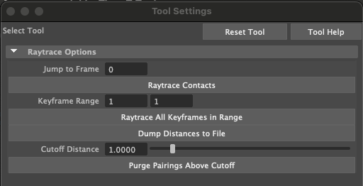

# Recovering Paired Hand-Object Contacts via Raycasting

This Edit Context plugin computes 1:1 point correspondances between object and hand contact points. It uses the (vertex-indexed) object contacts as the source of truth because GRAB objects are MUCH more densely triangulated than the MANO hand. These computed correspondences override hand contacts provided by GRAB.

## Setup

This plugin assumes a fresh import generated via the <a href="https://github.com/lakshmipathyarjun6/kinematic-motion-retargeting/tree/main/src/GRABMotionSequenceIO">GRABMotionSequenceIO</a> plugin. Specifically, it assumes that all entities (hand, object, and table) have been correctly named, object contacts are stored in the scene outline (e.g. left panel), and that the motion is accurate.

To get started, first copy the MEL files under the /scripts subdirectory to the following location:

Mac:
```
cp path/to/project/kinematic-motion-retargeting/src/contactRaytraceContext/scripts/* ~/Library/Preferences/Autodesk/maya/<year>/scripts
```

Linux:
```
cp path/to/project/kinematic-motion-retargeting/src/contactRaytraceContext/scripts/* ~/maya/<year>/scripts
```

Windows:
```
TODO
```

## Plugin activation

Run the following MEL command to activate the plugin:
```
setToolTo crc
```

If successfull, you should see the following Tool Editor menu:

<p align="center">

</p>

## Plugin tools

"Jump to Frame": Jumps the animation timeline to the specified frame and loads all the contacts (if any in that frame). Note that you must enter a different frame number than the value already in the window for anything to happen.

"Raytrace Contacts" Button: Compute the corresponding hand contacts for all of the object contacts in the current frame. Results are saved in the scene outliner under "contacts_<frame_number>". Once paired contacts are computed, jumping to the frame will render paired object contacts (magenta) and hand contacts (cyan) with dark blue lines linking each pair.

"Keyframe Range": Starting (first window) and ending (second window) keyframes to perform operations over for all buttons below this line.

"Raytrace All Keyframes in Range" Button: Perform the "Raytrace Contacts" Button operation in bulk for all the keyframes in range.

"Dump Distances to File" Button: Compute the L2 distances between all paired hand-object contacts across all specfieid keyframes and dump the results to the file specified <a href="https://github.com/lakshmipathyarjun6/kinematic-motion-retargeting/blob/main/src/contactRaytraceContext/contactRaytraceContext.hpp#L62">here</a> (if no absolute path is given, the home directory is assumed).

"Cutoff Distance": The L2 permittance distance threshold (in scene units - Maya defaults to cm) to consider contacts valid.

"Purge Pairings Above Cutoff" Button: Filters out all paired contacts for all the keyframes in range whose L2 distance exceeds that specified by "Cutoff Distance". Results are automatically stored in the scene outliner.

## General workflow

1. Compute contacts for all data frames

2. Dump the distances of all contacts in all frames

3. Plot the distances and view the distribution. It shold be strongly skewed right.

4. Set a distance threshold to prune contacts in the distribution tail. The exact choice depends on how much possible error you are willing to tolerate. I'd generally recommend something in the range of 1.0 - 2.0 (default unit is centimeters). My threshold was around 1.5 cm or so. I suggest starting with a higher number and reducing it if desired.

5. Prune all targeted contacts

6. Scan a few frames in the result to check for quality

7. Export the hand contacts via the <a href="https://github.com/lakshmipathyarjun6/kinematic-motion-retargeting/tree/main/src/contactSequenceIO">contactSequenceIO</a> plugin

Next step: <a href="https://github.com/lakshmipathyarjun6/kinematic-motion-retargeting/tree/main/src/contactTransferEditContext">contactTransferEditContext</a>
