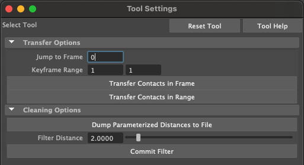

# Retargeting Contacts to Different Hands

This Edit Context plugin retargets / transfers contacts from one hand to another.

## Setup

This plugin assumes that axis landmarks have already been placed and that the transfer coefficients have already been set. If you are using a new hand and have not yet done so, please use the <a href="https://github.com/lakshmipathyarjun6/kinematic-motion-retargeting/tree/main/src/contactAxisCalibrationContext">contactAxisCalibrationContext</a> plugin first. The plugin assumes that the source hand is labeled as "hand" in the scene outline - the target hand can have any name. 

To get started, first copy the MEL files under the /scripts subdirectory to the following location:

Mac:
```
cp path/to/project/kinematic-motion-retargeting/src/contactTransferEditContext/scripts/* ~/Library/Preferences/Autodesk/maya/<year>/scripts
```

Linux:
```
cp path/to/project/kinematic-motion-retargeting/src/contactTransferEditContext/scripts/* ~/maya/<year>/scripts
```

Windows:
```
copy path\to\project\kinematic-motion-retargeting\src\contactTransferEditContext\scripts\* %HOMEPATH%\Documents\maya\2024\scripts
```

Then restart Maya once the scripts have been copied over.

## Plugin activation

Run the following MEL command to activate the plugin:
```
setToolTo ctec
```

If successfull, you should see the following Tool Editor menu:

<p align="center">

</p>

## Plugin tools

"Jump to Frame": Jumps the animation timeline to the specified frame and loads all the contacts (if any in that frame). Note that you must enter a different frame number than the value already in the window for anything to happen.

"Keyframe Range": Starting (first window) and ending (second window) keyframes to perform operations over for all buttons below this line.

"Transfer Contacts in Frame" Button: Performs a transfer of all source hand contacts to the target hand in the current frame and renders the result.

"Transfer Contacts in Range" Button: Performs a transfer of all source hand contacts to the target hand in across all keyframes in range.

"Dump Parameterized Distances to File" Button: Compute the geodesic distances of all target hand contacts to their computed landmarks across all keyframes in range and dump the results to the file specified <a href="https://github.com/lakshmipathyarjun6/kinematic-motion-retargeting/blob/main/src/contactTransferEditContext/contactTransferEditContext.hpp#L54">here</a>. If no absolute path is given, the file is created in the home directory.

"Filter Distance": Sets the geodesic distance threshold from each contact point's affiliate landmark. Any contact points further away than this threshold will not be rendered.

"Commit Filter" Button: Computes the geodesic distances of all contact points from their affiliate landmark across all keyframes in range and stores the result in the scene outliner. When contacts are exported using the <a href="https://github.com/lakshmipathyarjun6/kinematic-motion-retargeting/tree/main/src/contactSequenceIO">contactSequenceIO</a> plugin, filtered contacts will be noted under a JSON key called "OmissionIndices". These indices are used by the <a href="https://github.com/lakshmipathyarjun6/kinematic-motion-retargeting/tree/main/src/fusedMotionEditContext">fusedMotionEditContext</a> to determine which corresponding hand-object contact points to purge. Note, however, that commits to the scene outliner are "soft" - you can always set a new filter distance and re-compute the contact omissions. 

## General workflow

1. If you skipped the <a href="https://github.com/lakshmipathyarjun6/kinematic-motion-retargeting/tree/main/src/contactAxisCalibrationContext">contactAxisCalibrationContext</a> plugin, import the source hand contacts for the motion you wish to retarget via the <a href="https://github.com/lakshmipathyarjun6/kinematic-motion-retargeting/tree/main/src/contactSequenceIO">contactSequenceIO</a> plugin.

2. Retarget contacts for all frames.

3. Scan a few frames in the result to check for quality.

4. If there are contacts to ignore (e.g. target hand has fewer fingers), set the "Filter Distance" threshold, check a few frames to make sure that the undesired contacts are filtered out, and then run the "Commit Filter" button across all keyframes.

5. Export the target hand contacts via the <a href="https://github.com/lakshmipathyarjun6/kinematic-motion-retargeting/tree/main/src/contactSequenceIO">contactSequenceIO</a> plugin.

WARNING: This process will take some time, especially if there are a lot of contacts to retarget. It can take anywhere from from a few minutes to overnight to run.

Next step: <a href="https://github.com/lakshmipathyarjun6/kinematic-motion-retargeting/tree/main/src/fusedMotionEditContext">fusedMotionEditContext</a>
