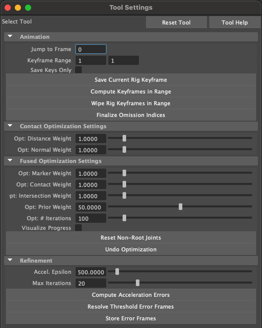

# Motion Retargeting Pipeline

This Edit Context plugin can be thought of as the "main" plugin which actually performs the motion retargeting.

## Setup

WARNING: There are significantly more steps for this plugin than the others. Since there is a lot to write out in text, I have made a [TODO: video] explaining how to set up and use the plugin.

As a starting point, it assumes you have:

1. A Maya scene with paired original hand and object contacts computed using the <a href="https://github.com/lakshmipathyarjun6/kinematic-motion-retargeting/tree/main/src/contactRaytraceContext">contactRaytraceContext</a> plugin. 

2. Contact data for the target hand in a JSON file exported from the <a href="https://github.com/lakshmipathyarjun6/kinematic-motion-retargeting/tree/main/src/contactTransferEditContext">contactTransferEditContext</a> plugin using the <a href="https://github.com/lakshmipathyarjun6/kinematic-motion-retargeting/tree/main/src/contactSequenceIO">contactSequenceIO</a> plugin.

Next, copy the MEL files under the /scripts subdirectory to the following location:

Mac:
```
cp path/to/project/kinematic-motion-retargeting/src/fusedMotionEditContext/scripts/* ~/Library/Preferences/Autodesk/maya/<year>/scripts
```

Linux:
```
cp path/to/project/kinematic-motion-retargeting/src/fusedMotionEditContext/scripts/* ~/maya/<year>/scripts
```

Windows:
```
TODO
```

If you have the previous two items ready to go and have copied the scripts over, the [TODO: video] will guide you through the remainder of the process.

## Plugin activation

Run the following MEL command to activate the plugin:
```
setToolTo fmec
```

If successfull, you should see the following Tool Editor menu:

If successfull, you should see the following Tool Editor menu:

<p align="center">

</p>

## Plugin tools

"Jump to Frame": Jumps the animation timeline to the specified frame and loads all the contacts (if any in that frame). Note that you must enter a different frame number than the value already in the window for anything to happen.

"Keyframe Range": Starting (first window) and ending (second window) keyframes to perform operations over for all buttons below this line.

"Save Keys Only" Checkbox: If selected, do not perform optimization on any of the keyframes in range and just store the existing (or interpolated) solution.

"Enter / Return" Keyboard Key: Compute the optimal hand configuration for the current keyframe. Does NOT save the result.

"Save Current Rig Keyframe" Button: Store the current hand configuration as a keyframe at the current frame in the animation timeline.

"Compute Keyframes in Range" Button: Computes optimal hand poses for all keyframes in range and stores the results in the animation timeline.

"Wipe Rig Keyframes in Range" Button: Deletes all hand pose keyframes in range.

"Finalize Omission Indices" Button: When contacts are imported for the particular target hand, "commits" ommitted points that were filtered by geodesic distance by wiping both hand and corresponding object contact points. Only needs to be run once.

"Opt: Distance Weight": Adjusts the value of $\lambda$<sub>cd</sub> in Eq (5) of the paper.

"Opt: Normal Weight": Adjusts the value of $\lambda$<sub>cn</sub> in Eq (5) of the paper.

"Opt: Marker Weight": Adjusts the value of $\lambda$<sub>m</sub> in Eq (3) of the paper.

"Opt: Contact Weight": Adjusts the value of $\lambda$<sub>c</sub> in Eq (3) of the paper.

"Opt: Intersection Weight": Adjusts the value of $\lambda$<sub>t</sub> in Eq (3) of the paper.

"Opt: Prior Weight": Adjusts the value of $\lambda$<sub>j</sub> in Eq (3) of the paper.

"Opt: # Iterations": Adjusts the total number optimization iterations.

"Visuzlize Progress" Checkbox: If selected, render intermediate states of the hand pose optimization process while in progress.

"Reset Non-Root Joints" Button: Debugging utility that sets the zeros-out the configuration of all joints of the hand rig except the root.

"Undo Optimization" Button: Debugging utility that resets the hand pose to its state before the last optimization call.

"Accel. Epsilon": Adjusts the value of $\Epsilon$<sub>acc</sub> in Section 3.4.3 of the paper.

"Max Iterations": Adjusts the maximum cap of acceleration refinement passes as described in Section 3.4.3 of the paper.

"Compute Acceleration Errors" Button: Computes the acceleration values for all hand joints within the keyframe range and renders the result as a new "plot" scene element, where the blue lines indicate the acceleration values and the red line indicates $\Epsilon$<sub>acc</sub>.

"Resolve Threshold Error Frames" Button: Performs the acceleration refinement smoothing over the keyframe range using the parameters specified above.

"Store Error Frames" Button (IMPORTANT): Computes all of the DOFs which violate $\Epsilon$<sub>acc</sub> per keyframe over the keyframe range and stores the result as a scene outliner element. You should ALWAYS hit this button at the end of the acceleration refinement stage, even if there are no outstanding violations, as it will be queried by the <a href="https://github.com/lakshmipathyarjun6/kinematic-motion-retargeting/tree/main/src/smoothMotionEditContext">smoothMotionEditContext</a> plugin to determine which keyframes per DOF to ignore during the B-Spline fitting process.

## General workflow

Please see the [TODO: video] for detailed steps. But as a rough guideline:

1. Compute the trajectory using only root degrees of freedom (DOFs).

2. Compute the trajectory using all (DOFs). This process can be very slow, especially if there are a lot of contacts. I would strongly suggest letting it run overnight or all day. The root cause of this slowdown is that all gradients are computed using finite differencing - please see the paper for more details.

3. Filter the trajectory using low pass and peak removal filters.

4. Re-compute the trajectory of after filtering with all DOFs included.

5. Run acceleration refinement to improve temporal consistency.

6. Save the final result, then close and re-open Maya.

Next (and final) step: <a href="https://github.com/lakshmipathyarjun6/kinematic-motion-retargeting/tree/main/src/smoothMotionEditContext">smoothMotionEditContext</a>
