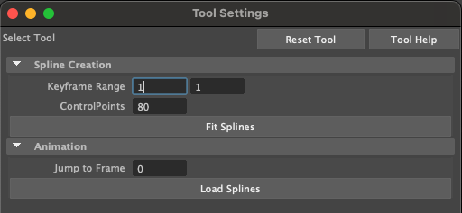

# B-Spline Fitting of Retargetd Motion

This Edit Context plugin is the final one in the processing sequence, which fits the final estimated motion trajectory with B-Splines to compute the final result.

## Setup

This plugin assumes a scene that has been fully processed using the <a href="https://github.com/lakshmipathyarjun6/kinematic-motion-retargeting/tree/main/src/fusedMotionEditContext">fusedMotionEditContext</a> plugin.

To get started, first copy the MEL files under the /scripts subdirectory to the following location:

Mac:
```
cp path/to/project/kinematic-motion-retargeting/src/smoothMotionEditContext/scripts/* ~/Library/Preferences/Autodesk/maya/<year>/scripts
```

Linux:
```
cp path/to/project/kinematic-motion-retargeting/src/smoothMotionEditContext/scripts/* ~/maya/<year>/scripts
```

Windows:
```
TODO
```

## Plugin activation

Run the following MEL command to activate the plugin:
```
setToolTo smec
```

If successfull, you should see the following Tool Editor menu:

<p align="center">

</p>

## Plugin tools

"Keyframe Range": Starting (first window) and ending (second window) keyframes to perform operations over for all buttons below this line.

"Control Points": Specifies the number of B-Spline control points to use during the fitting process. The same number of control points are used for all hand DOFs.

"Fit Splines" Button: Fits B-Splines for all the hand DOFs over the specified keyframe range, stores the result in the outliner, and renders the splines to the viewport. The first frame and last frame have full multiplicity (e.g. each B-spline is an open curve clamped at the endpoints).

"Jump to Frame": Jumps the animation timeline to the specified frame and loads all the contacts (if any in that frame). Note that you must enter a different frame number than the value already in the window for anything to happen.

"Load Splines" Button: Loads the spline group actively selected in the scene outliner to the hand DOFs. The selection requirement is because you might want to try fitting splines with different numbers of control points.

## General workflow

1. Compute fitted B-Splines for all hand DOFs across all frames.

2. Select the generated splines in the scene outline, then hit the "Load Splines" button in the tool plugin window.

3. Your final retarted result is complete! Enjoy!

[TODO: Exports??]
